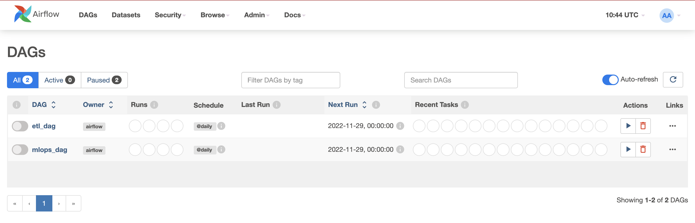
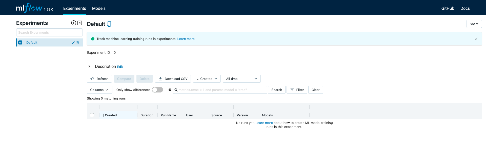
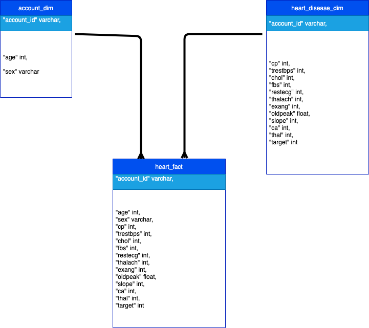

# MLOPS-AIRFLOW-MLFLOW

## Background
The goal of this project is to run a **Machine Learning Pipeline**.

## Getting started

### Docker
Create `docker-compose.yaml` which is responsible for running `Airflow` components, each on a different container:
* airflow-webserver
* airflow-scheduler
* airflow-worker
* airflow-triggerer
* mlflow server
* postgresql
* pgadmin

From terminal, run the following command to start Airflow on port 8080:
```
docker compose up -d
```

### Airflow
After running docker container, visit the page: `localhost:8080`


And log into the Airflow world!

Populate the `dags` folder with all the DAGS needed for the project.
Before running any DAGs, establish a connection with PostgreSQL.

#### DAGS - ETL

This DAG is responsible for extracting data (locally), transform and load into a PostgreSQL table.


### MLFlow
On the `docker-compose.yaml` includes the `mlflow` container in the `services` section.
This container is responsible for running the `MLFlow server` exposed on the `localhost:600`.


Open the `example_dag.py` and set the URI of the current MLFlow server(localhost:600)
```
mlflow.set_tracking_uri('http://mlflow:600')
```

After updating the URI of the MLFlow server, create a new connection on `Airflow`.


## Data Sources
Below there are the schemas of `heart_fact`, `heart_disease_dim` and `account_dim`.
```yaml
CREATE TABLE IF NOT EXISTS public.heart_fact(
	"account_id" varchar,
    "age" int,
    "sex" varchar,
    "cp" int,
    "trestbps" int,
    "chol" int,
    "fbs" int,
    "restecg" int,
    "thalach" int,
    "exang" int,
    "oldpeak" float,
    "slope" int,
    "ca" int,
    "thal" int,
    "target" int
);

CREATE TABLE IF NOT EXISTS public.heart_disease_dim(
	"account_id" varchar,
    "cp" int,
    "trestbps" int,
    "chol" int,
    "fbs" int,
    "restecg" int,
    "thalach" int,
    "exang" int,
    "oldpeak" float,
    "slope" int,
    "ca" int,
    "thal" int,
    "target" int
);

CREATE TABLE IF NOT EXISTS public.account_dim(
	"account_id" varchar,
    "age" int,
    "sex" varchar
);
```



### Tech Stack
* Airflow
* MLflow
* Docker
* Python


### References
* [Airflow Docker](https://airflow.apache.org/docs/apache-airflow/stable/howto/docker-compose/index.html)
* [MLOps deployment](https://towardsdatascience.com/ml-model-deployment-strategies-72044b3c1410)
* [Integrate MLFlow](https://medium.com/@kaanboke/step-by-step-mlflow-implementations-a9872dd32d9b)
* [Productionize on Docker](https://medium.com/cometheartbeat/create-an-mlops-pipeline-with-github-and-docker-hub-in-minutes-4a1515b6a551)
