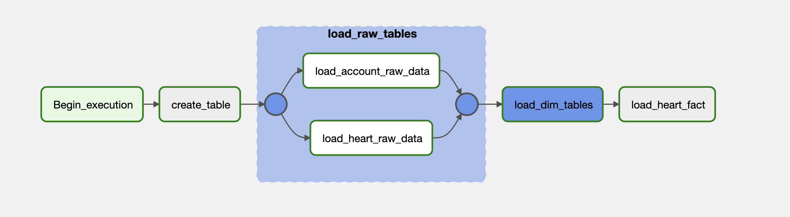
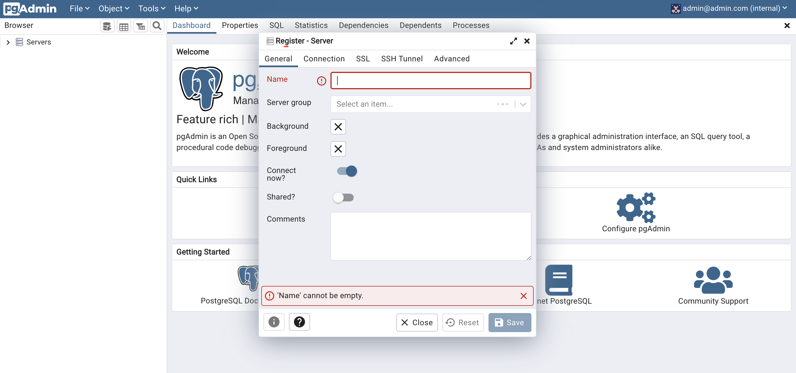

# MLOPS-AIRFLOW-MLFLOW


## Table of content
- [Business Context](#business_context)
- [Data Sources](#data_sources)
- [System Design](#system_design)
    * [System Design - Data Warehouse development](#system_design_dwh)
        - [System Design - Data Source](#system_design_data_source)
        - [System Design - Data Transformation/Loading](#system_design_data_transformation)
        - [System Design - Data Warehouse](#system_design_data_warehouse)
    * [System Design - Machine Learning Pipeline](#ml_pipeline)
- [Tech Stack](#tech_stack)
    * [Docker](#docker)
    * [Airflow](#airflow)
    * [MLFlow](#mlflow)
    * [PostgreSQL](#postgresql)
- [References](#references)


<a name="business_context"/>

## Business Context
The goal of this project is to analyze heart data to predict hypothetical future diseases.

<a name="data_sources"/>

## Data Sources
[Here](https://www.kaggle.com/code/nairkarthik16/eda-and-prediction/data) you can find the source data of this project.

<a name="system_design"/>

## System Design
The project has been composed by two parts:
* `Data Warehouse` development
* `Machine Learning` pipeline

Both parts are implemented in `Airflow` as dag. So, each of them is composed by a sequence of tasks to accomplish a goal.

<a name="system_design_dwh"/>

## System Design - Data Warehouse development


<a name="system_design_data_source"/>

### System Design - Data Source
The input data are stored locally in a way that they are available from Docker containers.

<a name="system_design_data_transformation"/>

### System Design - Data Transformation/Loading
The transformation and loading operations are accomplished by the etl_dag script run on Airflow.

This DAG is responsible for extracting data (locally), transform and load into a `PostgreSQL` table.

It's possible to review `PostgreSQL` tables from `PgAdmin`.
Below there's the `ETL` workflow on `Airflow`:



<a name="system_design_data_warehouse"/>

### System Design - Data Warehouse
The Data Warehouse of the project has been stored on PostgreSQL.

Below there are the schemas of `heart_fact`, `heart_disease_dim` and `account_dim`.
```
CREATE TABLE IF NOT EXISTS heart_analysis.heart_fact(
	"account_id" varchar,
    "age" int,
    "sex" int,
    "cp" int,
    "trestbps" int,
    "chol" int,
    "fbs" int,
    "restecg" int,
    "thalach" int,
    "exang" int,
    "oldpeak" float,
    "slope" int,
    "ca" int,
    "thal" int,
    "target" int,
    PRIMARY KEY("account_id")
);

CREATE TABLE IF NOT EXISTS heart_analysis.heart_disease_dim(
	"account_id" varchar,
    "cp" int,
    "trestbps" int,
    "chol" int,
    "fbs" int,
    "restecg" int,
    "thalach" int,
    "exang" int,
    "oldpeak" float,
    "slope" int,
    "ca" int,
    "thal" int,
    "target" int,
    PRIMARY KEY("account_id")
);

CREATE TABLE IF NOT EXISTS heart_analysis.account_dim(
	"account_id" varchar,
    "age" int,
    "sex" int,
    PRIMARY KEY("account_id")
);
```


<a name="ml_pipeline"/>

## System Design - Machine Learning Pipeline


<a name="tech_stack"/>

### Tech Stack

<a name="docker"/>

### Docker
Create `docker-compose.yaml` which is responsible for running `Airflow` components, each on a different container:
* airflow-webserver
* airflow-scheduler
* airflow-worker
* airflow-triggerer
* mlflow server
* postgresql
* pgadmin

From terminal, run the following command to start Airflow on port 8080:
```
docker compose up -d
```

<a name="airflow"/>

### Airflow
After running docker container, visit the page: `localhost:8080`


And log into the Airflow world!

Populate the `dags` folder with all the DAGS needed for the project.
Before running any DAGs, establish a connection with PostgreSQL.

<a name="mlflow"/>

### MLFlow
On the `docker-compose.yaml` includes the `mlflow` container in the `services` section.
This container is responsible for running the `MLFlow server` exposed on the `localhost:600`.


Open the `example_dag.py` and set the URI of the current MLFlow server(localhost:600)
```
mlflow.set_tracking_uri('http://mlflow:600')
```

After updating the URI of the MLFlow server, create a new connection on `Airflow`.

<a name="postgresql"/>

### PostgreSQL
On the `docker-compose.yaml` includes the `postgres` and `pgadmin` containers in the `services` section.
First of all, access to `localhost:5050` to create a connection to `postgres`


Then, on the section server it's easy to monitor and query those tables.

<a name="references"/>

### References
* [Airflow Docker](https://airflow.apache.org/docs/apache-airflow/stable/howto/docker-compose/index.html)
* [MLOps deployment](https://towardsdatascience.com/ml-model-deployment-strategies-72044b3c1410)
* [Integrate MLFlow](https://medium.com/@kaanboke/step-by-step-mlflow-implementations-a9872dd32d9b)
* [Productionize on Docker](https://medium.com/cometheartbeat/create-an-mlops-pipeline-with-github-and-docker-hub-in-minutes-4a1515b6a551)
